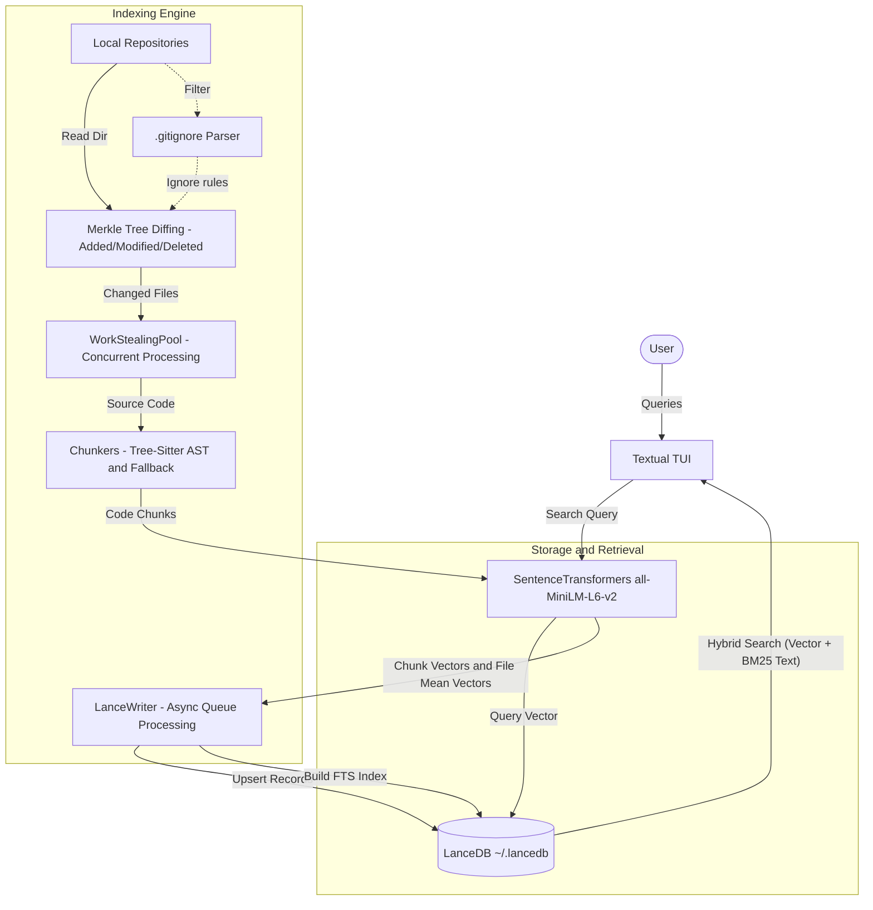

# CodeSearch

CodeSearch is a cross-repository semantic code search TUI tool. It leverages the power of LanceDB to provide hybrid search capabilities directly from your terminal.

## Key Features

- **Textual TUI**: A rich, responsive terminal user interface to browse and search your repositories.
- **Hybrid Search**: Combines full-text BM25 matching with semantic search (via SentenceTransformers and LanceDB) so you can find code by intent, not just exact keywords.
- **Incremental Indexing**: Uses a Merkle tree-based system to hash directory structures, guaranteeing that only modified files are intelligently re-indexed. This saves vast amounts of time and computational resources.
- **Smart Gitignore Integration**: Dynamically parses and respects project `.gitignore` files to keep dependencies, build artifacts, and environment files out of your index.
- **Centralized Knowledge Base**: Consolidates indexed snippet embeddings into a central `~/.lancedb` store, making cross-repository code discovery effortless.

## Architecture



## Getting Started

To launch the interactive terminal UI, simply run:

```bash
uv run codesearch-ui
```

To run the standard CLI (if applicable):

```bash
uv run codesearch --help
```
